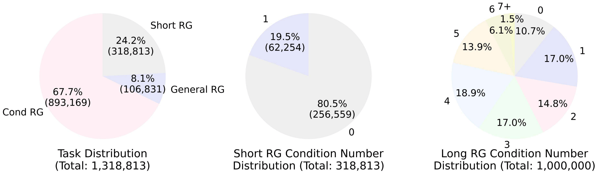
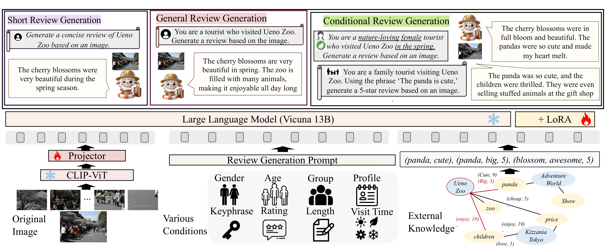
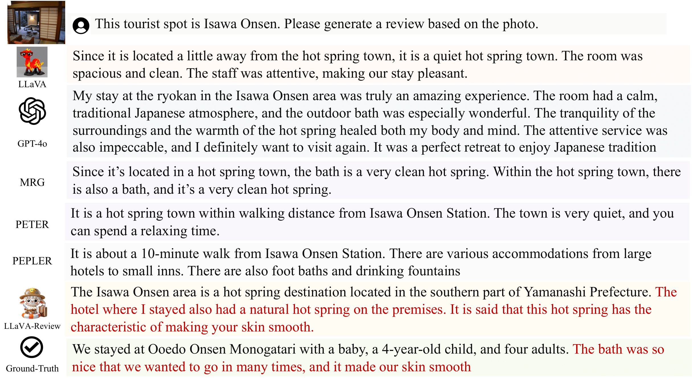
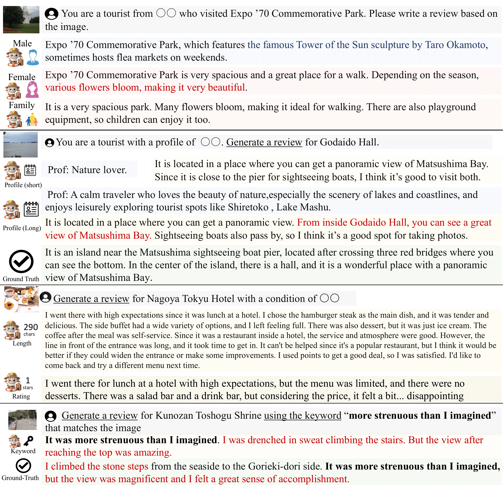

# TourMix1M

## Overview
code for "A Multimodal Dataset and Benchmark for Tourism Review Generation" in RecTour@RecSys24

## License

This work is licensed under a [Creative Commons Attribution-NonCommercial-ShareAlike 3.0 License](http://creativecommons.org/licenses/by-nc-sa/3.0/). This dataset is intended for research purposes only and cannot be used commercially.

Please refrain from using it for commercial purposes, such as training LLM or deep learning models for your own services, analyzing data to improve your service’s sales, or any activities that may conflict with the interests of Jalan.net.

## Data

### image_url.csv
Contains image information for tourist spots.
* spot_name: Tourist spot name
* id: Unique identifier
* image_url: Image URL

### train.csv
Training data for the model.
* id: Unique identifier
* short_prompt, long_prompt: Review generation prompts
* short_review, long_review: Generated reviews
* Various flags: gender, age, tag, month, season, profile, rating, length, feature

### test.csv
Test data for model evaluation.
* id: Unique identifier
* spot: Tourist spot name
* review: Review text
* User attributes: gender, age
* Visit details: tag, month, season
* User profile: profile_tag, profile_long
* Review characteristics: rating, length, feature

### summary*.pkl
* summary of tourism spots made by gemma2-2b and gemma2-9b

### normal.json
* training data used to train LLaVA

### summary.json
* trainig data with summary

## Usage
The link to data <a href="https://drive.google.com/drive/folders/1HAd_wA0oCJLcNKxeM1qrr8FLZDprJQr8?usp=drive_link" target="_blank">[data]</a>usp=drive_link

make dataset

```python
cd preprocess
python make_dataset.py (please excute with make_trainig_data function and review only mode)
```

make kg
```python
cd preprocess
python make_kg.py
python knowledge_graph.py (please also check code)
```

make summary
```python
export VLLM_ATTENTION_BACKEND=FLASHINFER
python prompt_llm.py --model_type gemma2 --tensor_parallel_size 1  --method summarize_review_diversity_sample --index 0 --partition_num 4 --prompt_type normal (please also check code and execute )
```

normal traininig 

please change data_path in script to normal.json

```bash
bash scripts/v1_5/finetune_lora_jalan.sh
```

KG traininig 

please change data_path in script to normal.json
```bash
bash scripts/v1_5/finetune_lora_jalan_retrieve.sh
```

Summary traininig 

please change data_path in script to summary.json
```bash
bash scripts/v1_5/finetune_lora_jalan_retrieve.sh
```

Inference (normal review generation)
```python
python inference.py -f review_generation --model_name llavatour model-path (learned path) model-base lmsys/vicuna-13b-v1.5
```

Inference (conditional review generation)
```python
python inference.py -f inference_review_generation_attribute --attribute age --model_name llavatour model-path (learned path) model-base lmsys/vicuna-13b-v1.5
```


  
## Dataset
TourMix1M is a large-scale multimodal dataset consisting of one million review instances related to Japanese tourist spots. It includes reviews under various conditions such as images, user attributes, user profiles, review ratings, review lengths, key phrases, and visit seasons.

### Dataset Statistics

The main statistics of the dataset are as follows:

| Component | Count |
|-----------|-------|
| Dialogues | 1,000,000 |
| Prompts | 1,310,000 |
| Reviews | 545,891 |
| Images | 476,167 |
| Tourism Spots | 51,011 |



## Model

LLaVA-Review is a large-scale multimodal model fine-tuned on the TourMix1M dataset. It takes images and natural language instructions as input and generates tourism reviews. The Code is based on our [LLaVATour](https://github.com/HiromasaYamanishi/LLaVATour) implementation.

### Model Architecture



## Results of General Review Generation

### Performance Comparison Table

| Model | BLUE | ROUGE-1 | ROUGE-L | CIDEr | DIV | PROPN | TFIDF-F1 | Senti-F1 | length |
|-------|------|---------|---------|-------|-----|-------|----------|----------|--------|
| LLaVA-1.5 | 0.683 | 0.254 | 0.162 | 0.099 | 0.863 | 0.303 | 0.141 | 0.029 | 133.8 |
| ChatGPT-4V | 0.622 | 0.250 | 0.165 | 0.103 | 0.955 | 0.278 | 0.169 | 0.036 | 70.9 |
| LLaVA-Review | 1.291 | 0.272 | 0.185 | 0.108 | 0.920 | 0.457 | 0.244 | 0.045 | 54.9 |

### Generation Example



## Results of Conditional Review Generation

### Generation Examples




